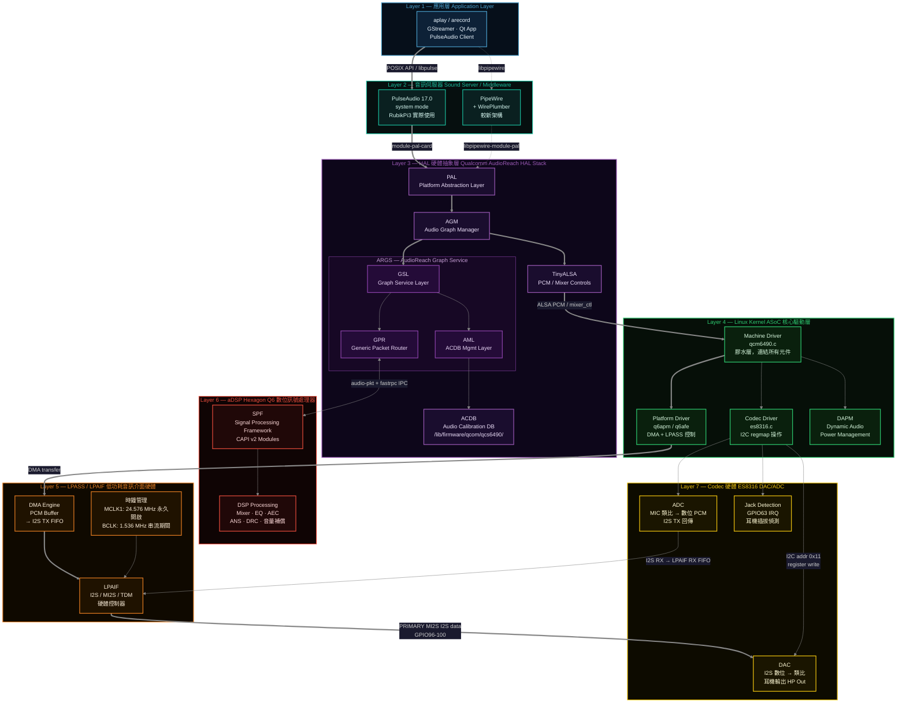

# Linux Audio 全觀 — QCS6490 (RubikPi3) 音訊系統深度解析

## 零、架構速覽：從 App 到喇叭的七層旅程

理解 Linux 音訊，最關鍵的是先在腦中建立「聲音流要走哪條路」的全貌。以下以 RubikPi3（QCS6490 + ES8316）為例，展示完整的垂直架構。



> **RubikPi3 關鍵事實：** QCS6490 晶片內建的 WCD 系列 Codec（WCD938x）與 SoundWire 匯流排在 RubikPi3 的 Device Tree 中**全部停用**（`status = "disabled"`）。音訊路徑完全依賴外部 ES8316 Codec，透過 **PRIMARY MI2S** 接口。

---

# 一、ALSA (Advanced Linux Sound Architecture)：Linux Kernel 音訊框架

對於系統廠的 BSP 或韌體工程師來說，**ALSA (Advanced Linux Sound Architecture)** 不僅僅是「音效驅動」，它是 Linux 核心中負責處理音訊硬體的一套複雜架構。在 QCS6490 這種高通平台上，你通常會透過 **ASoC (ALSA System on Chip)** 這個子層來與它打交道。

ALSA 是環境，DAI 是接口。

## ALSA 的核心組成

在 Linux 系統中，ALSA 替代了舊有的 OSS (Open Sound System)，提供更強大的多處理能力與 MIDI 支援。它主要分為兩個世界：

- **Kernel Space (內核空間)：**
    - **Drivers：** 直接操控硬體暫存器（如你的 ES8316）。
    - **ASoC Layer：** 這是嵌入式工程師的重點，它將音訊系統拆解為三個部分：
        1. **Codec Driver：** 處理音訊編解碼（如 ES8316 的增益、濾波器、ADC/DAC）。對應 `sound/soc/codecs/es8316.c`。
        2. **Platform Driver (DMA)：** 負責 SoC 內部的音訊傳輸。在高通平台上，這由 **q6apm**（Audio Process Manager）與 **q6afe**（Audio Front End）兩個 kernel driver 負責，它們同時扮演 DMA buffer 管理者與 LPASS 控制者的角色。
        3. **Machine Driver (The Glue)：** 將上述兩者「連起來」的膠水層，定義哪個 I2S 介面接哪顆 Codec，以及時鐘（MCLK/BCLK）的生命週期管理。RubikPi3 對應 `sound/soc/qcom/qcm6490.c`。
- **User Space (用戶空間)：**
    - **alsa-lib：** 提供 API 給開發者（如 `snd_pcm_open`）。
    - **alsa-utils：** 我們常用的工具，如 `aplay` (播放)、`arecord` (錄音)、`amixer` (控制音量)。
    - **TinyALSA：** alsa-lib 的輕量版，常見於嵌入式系統。高通 AGM 直接使用 TinyALSA 操作 ALSA kernel interface。

## ALSA 關鍵名詞術語

當你在調校 QCS6490 的音訊時，會頻繁遇到這些術語：

- **PCM (Pulse Code Modulation)：** 脈衝編碼調變。在 ALSA 中，這代表邏輯上的音訊流。
- **Card & Device：**
    - **Card：** 對應一整組硬體系統（如 QCS6490 內部音訊子系統）。
    - **Device：** Card 下的子單元（例如 Device 0 可能是喇叭，Device 1 可能是耳機）。
- **Control / Mixer：** 調整音量、切換輸入源、開關 Power Domain。對於 ES8316，這些是透過 I2C 修改暫存器來達成的。
- **DAPM (Dynamic Audio Power Management)：** 這是 ASoC 的靈魂。它會根據目前的音訊路徑，自動開啟或關閉 Codec 與 SoC 內部的元件，以達到省電效果。

**ALSA** 是框架，**ASoC** 是方法論，而 **ES8316** 只是這個框架下的一個 `Codec` 插件。你現在在 `i2c-0` 看到的 `0x11` (UU)，正代表 ALSA 內核驅動已經成功佔用了這顆晶片，準備好進行音訊處理了。

**ALSA 的概念就是 user-space 的可以操控 audio 的上層軟體。 至於上層軟體要怎麼串到 Kernel Space 的 ASoC 就要看** Audio Software Architecture。

---

# 二、ASoC Kernel Driver 三角架構：機器、平台、Codec

在深入 HAL 之前，先弄清楚 Kernel 裡面 ASoC 三個 Driver 是如何分工的，這是理解一切的基礎。

## Machine Driver — `sound/soc/qcom/qcm6490.c`

Machine Driver 是整個 SoC 音訊系統的**配置中心**，它不處理任何音訊資料，只負責「把誰接到誰」。

| 職責 | RubikPi3 實作 |
|------|-------------|
| 定義 DAI Link（誰接誰）| PRIMARY_MI2S → ES8316、QUATERNARY_MI2S → LT9611 |
| 管理時鐘生命週期 | MCLK 永久開啟，BCLK 隨串流 startup/shutdown |
| Jack 偵測初始化 | `qcom_snd_wcd_jack_setup()` |
| 強制 Backend 參數 | `be_hw_params_fixup`：強制 48kHz / 2ch |

**ES8316 特有設計：MCLK 永不關閉**

ES8316 要求 MCLK 保持持續供應；若 MCLK 在播放過程中切換，會產生 POP 聲。因此 `qcm6490.c` 用 `pri_mi2s_mclk_count` 做參考計數，第一個串流開啟時啟動 MCLK（24.576 MHz），之後任何情況都不再關閉它。

```c
// sound/soc/qcom/qcm6490.c
// The ES8316 IC requires MCLK to be constantly on.
if (++(data->pri_mi2s_mclk_count) == 1) {
    snd_soc_dai_set_sysclk(cpu_dai,
        Q6AFE_LPASS_CLK_ID_MCLK_1,
        DEFAULT_MCLK_RATE,    /* 24.576 MHz */
        SNDRV_PCM_STREAM_PLAYBACK);
}
```

## Platform Driver — q6apm / q6afe

這兩個 driver 是 ASoC 與 LPASS/aDSP 之間的橋樑，位於 `sound/soc/qcom/qdsp6/`。

| Driver | 全稱 | 職責 |
|--------|------|------|
| **q6apm** | Q6 Audio Process Manager | 管理 SPF 上的 Graph（audio pipeline），對應 LPASS APM 硬體模組 |
| **q6afe** | Q6 Audio Front End | 管理 I2S / TDM / MI2S port 的硬體配置，設定 BCLK、取樣率、bit 寬度 |
| **q6apm-dai** | APM DAI | 向 ASoC 暴露 `PRIMARY_MI2S_RX / TX` 等 CPU DAI 端點 |

```
User Space PCM write()
    ↓
ALSA Core (snd_pcm_write)
    ↓
q6apm platform driver → DMA buffer management
    ↓
q6afe → LPAIF hardware register (MI2S port config)
    ↓
LPAIF DMA → I2S TX FIFO → ES8316
```

## Codec Driver — `sound/soc/codecs/es8316.c`

| 職責 | 說明 |
|------|------|
| I2C 暫存器操作 | 透過 `regmap` 讀寫 ES8316 的 0x00–0x53 暫存器 |
| `hw_params` | 設定取樣率（8–48kHz）、位元深度（S16/S24）、格式（I2S） |
| DAPM 路由 | 定義 DAC → HP Mixer → 耳機放大器的訊號路徑圖 |
| Jack 偵測 | IRQ（GPIO63）觸發，辨識耳機插拔 |
| init-regs | RubikPi3 特有：從 Device Tree 讀取 40+ 寄存器初始化序列 |

## DAPM — 動態電源管理

DAPM（Dynamic Audio Power Management）是 ASoC 的省電引擎。它維護一張「元件相依圖」（Widget Graph），自動判斷目前的音訊路徑需要哪些硬體 block 上電，不需要的自動斷電。

```
播放耳機時，DAPM 自動開啟：
  DAC L/R → HP Mixer → Charge Pump → HP Driver → 耳機輸出

停止播放時，DAPM 自動關閉上述所有 block，節省功耗。
```

---

# 三、Audio Software Architecture：Kernel Space 以及 User Space 之間的限定路徑


High-level audio software architecture

### **PulseAudio（Sound Server）**

一個針對 POSIX 作業系統（主要為 Linux）設計的 Sound server。它在硬體驅動程式（Device drivers）與應用程式之間扮演 Proxy 與 Router 的角色，支援單一或多個 Host。

**RubikPi3 實際情況：** 使用 **PulseAudio 17.0（system mode）** 作為音訊伺服器，透過 module-pal-card（pa-pal-plugins 套件）連接至 PAL → AGM → LPAIF。以 --system 模式由 systemd 啟動（pulse 用戶）。

> **PipeWire 補充（較新架構）：** 新世代 Qualcomm Linux 發行版逐漸改用 **PipeWire + WirePlumber** 取代 PulseAudio。PipeWire 透過 libpipewire-module-pal.so（qcom-pw-pal-plugin_git.bb）連接 PAL。RubikPi3 目前映像未安裝 PipeWire，但 Yocto recipe 中已有對應套件，未來可能切換。

### **Platform Audio Layer (PAL)**

提供高階且針對音訊優化的 API，用以存取底層音訊硬體與驅動程式，進而實現功能豐富的 Audio use cases。

PAL 是 Qualcomm AudioReach 架構的**統一 HAL 入口**，對上層（PulseAudio / PipeWire）提供設備無關 API，對下層驅動 AGM，並管理音訊 session 的完整生命週期（創建 → 配置 → 啟動 → 停止 → 銷毀）。RubikPi3 PAL 包含多個平台特定 patch，例如修改 speaker/mic 後端配置、增加耳機播放預設音量等。

### **Audio Graph Manager (AGM)**

提供介面讓基於 TinyALSA 的 Mixer controls 以及 PCM/Compressed plug-ins 能夠互相溝通，並啟用各種 Audio use cases。

AGM 是高通為了取代舊有封閉式音訊路徑管理，所開發的**開源用戶空間中間件**。它維護音訊路徑拓撲（Topology），並透過 TinyALSA 的 mixer_ctl 介面向 Kernel ASoC driver 下達配置指令。AGM 包含一組 XML 配置文件，描述各種 use case 的後端對應關係，RubikPi3 有專屬 patch 修改這些 XML（例如將 ES8316 錄音格式從 1ch 改為 2ch）。

### **AudioReach Graph Service (ARGS)**

由 Graph Service Layer (GSL)、Generic Packet Router (GPR) 及 ACDB Management Layer (AML) 模組組成。負責處理 Graph 的初始化與建立，並產生封包以傳送一系列指令給 SPF。

| 子模組 | 職責 |
|--------|------|
| **GSL（Graph Service Layer）** | 管理 SPF Graph 生命週期（open/close/start/stop）；持有 ACDB 圖形拓撲資訊 |
| **GPR（Generic Packet Router）** | 在 APPS 處理器與 aDSP 之間路由命令封包；透過 udio-pkt kernel driver 跨處理器通訊 |
| **AML（ACDB Management Layer）** | 讀取 ACDB 資料庫，提供模組校準參數給 GSL 初始化 SPF module |

### **Audio calibration database (ACDB)**

包含各種 Audio use cases 的資訊，例如 Use case graphs、模組校準數據（Module calibration data）等。APPS 處理器會解析 ACDB 檔案來獲取 Use case graph 資訊，供 SPF 用來實例化（Instantiate）該 Use case。

ACDB 資料以二進位格式儲存，部署路徑為 /lib/firmware/qcom/qcs6490/。可使用 **QACT** 從 PC 端透過 USB 即時修改校準參數並寫入 ACDB，無需重新燒錄 firmware。

### **Signal Processing Framework (SPF)**

運行於 LPAI DSP 上的模組化框架。它提供了建立、配置與執行音訊處理模組（Signal processing modules）的手段。

SPF 的模組遵循 **CAPI v2（Common Audio Processor Interface v2）** 介面規範。每個模組（如 EQ、AEC、ANS）都是一個 CAPI v2 plugin，可動態載入並串接成處理鏈（pipeline）。Topology 配置文件（qcs6490-rb3gen2-snd-card-tplg.conf）定義了哪些模組串接成哪種 use case 的 graph。

### **Qualcomm Audio Calibration Tool (QACT™ Platform)**

一套基於 PC 的軟體，提供 GUI 讓音訊系統設計人員能夠視覺化、配置並將 Audio graphs 儲存至 ACDB 中，以實現預期的 Audio use cases。

Audio Software Architecture 讓 user-space 以指定的路徑存取到 Kernel 當中的 ASoC 的底層 Kernel Driver，也就是「聲音流」的「路徑 (Route)」。

- 這條「路徑」從軟體層面看來就是 Middleware 以及 HAL 在控制的：PulseAudio → PAL → AGM → ARGS → SPF。
- 這條「路徑」從硬體層面來看就是晶片上當中的各種音訊處理硬體，牽涉到 aDSP/LPASS 等等晶片的硬體模組。
# 四、aDSP/LPASS：晶片上的音訊處理硬體

音訊處理並非單純由 CPU 完成，而是交給專門的硬體子系統。要理解 **aDSP** 與 **LPASS**，必須將它們放入 **ALSA/ASoC** 的框架中觀察。

### **LPASS (Low Power Audio Subsystem)**

- **定義：** 這是高通 SoC 內部一個獨立的硬體塊（Hardware Block），擁有自己的電源域（Power Domain）與時鐘樹。
- **功能：** 專門負責音訊的「搬運」與「基礎接口控制」。它包含了 I2S/TDM/MI2S/DMIC 控制器、專用的 DMA 引擎，以及一個低功耗 DSP 核心（即 aDSP 的宿主）。
- **目的：** 讓 Applications Processor（CPU）在播放音樂時可以進入深層休眠（System Sleep），由 LPASS 獨立處理音訊傳輸，達到省電目的。

#### LPAIF（Low-Power Audio InterFace）：LPASS 的介面控制器

是 Qualcomm SoC 內部負責搬運音訊資料的硬體匯流排控制器，可把它想像成 SoC 晶片內部的「音訊資料高速公路」：

- **播放時：** CPU 將 PCM buffer 透過 DMA 搬到 LPAIF 的 TX FIFO，LPAIF 的 MI2S 控制器以 I2S 協議將資料串列輸出給外部 Codec（ES8316）的 DAC，轉成類比音訊。
- **錄音時：** 方向相反——ES8316 ADC 將類比麥克風訊號轉成數位 PCM，透過 I2S 送進 LPAIF 的 RX FIFO，再由 DMA 搬到系統記憶體。

#### LPASS 內部的 MI2S 介面（RubikPi3）

| MI2S 介面 | 用途 | 連接對象 |
|-----------|------|----------|
| PRIMARY MI2S | 耳機播放 + 麥克風錄音 | ES8316（GPIO96–100）|
| QUATERNARY MI2S | HDMI 音訊輸出 | LT9611 HDMI Bridge（GPIO6–9）|
| TERTIARY MI2S | 第三路 I2S（patch 啟用）| 擴展用 |

**時鐘說明：**

| 時鐘 | 頻率 | 生命週期 | 用途 |
|------|------|----------|------|
| MCLK1 | 24.576 MHz | **永久開啟**（避免 POP 聲）| ES8316 的系統參考時鐘 |
| PRIMARY MI2S BCLK | 1.536 MHz | 隨串流 startup/shutdown | I2S bit clock（資料同步）|
| PRIMARY MI2S WS | 48 kHz | 與 BCLK 一起 | Word Select / LRCLK（L/R 聲道同步）|

計算：1.536 MHz = 48,000 Hz × 32 bits/sample × 2 ch

### **aDSP (Application Digital Signal Processor) — Hexagon Q6**

- **定義：** 高通 SoC 內建的 **Hexagon Q6 DSP**，運行於 LPASS 的低功耗電源域中，與 Applications Processor 分開。
- **功能：** 執行 SPF（Signal Processing Framework）所有的訊號處理模組，例如：
  - AEC（回音消除 Acoustic Echo Cancellation）
  - ANS/NS（降噪 Noise Suppression）
  - ANC（主動降噪 Active Noise Cancellation）
  - 多聲道混音（Mixer）
  - EQ（均衡器）、動態範圍壓縮（DRC）
  - 音量增益補償（Post-processing gain）
- **通訊：** aDSP 與 APPS 處理器透過 **fastrpc**（Fast Remote Procedure Call）機制通訊；音訊控制指令透過 `audio-pkt` kernel driver 以 GPR（Generic Packet Router）封包格式傳遞。
- **韌體：** SPF 韌體存放於 `/lib/firmware/qcom/qcs6490/`，在 `adsprpcd_audiopd.service` 啟動時由 APPS 側載入到 DSP。

前面提到聲音流的「路徑」都還是 QCS6490 晶片的硬體/軟體層面，這個聲音流之後需要透過 Codec 和喇叭（或耳機）將通過複雜「路徑」後的聲音播放出來。

### Codec 分類補充（RubikPi3 與 Qualcomm 通用平台的差異）

在 Qualcomm 平台上，Codec 通常分為兩種類型：

| 類型 | 代表晶片 | 連接介面 | RubikPi3 狀態 |
|------|---------|---------|---------------|
| **Qualcomm 內建 Codec** | WCD938x（WCD9380/9385/9390）| SoundWire bus（多線串列）| **全部停用**（DT `status = "disabled"`）|
| **外部獨立 Codec** | ES8316（Everest Semiconductor）| I2S（PRIMARY MI2S）+ I2C（控制）| **RubikPi3 唯一使用的 Codec** |

> **常見誤解澄清：** WCD938x 並非「純類比 Codec」、ES8316 並非「純數位 Codec」——兩者都是混合訊號（mixed-signal）晶片，都包含 ADC + DAC（類比電路）以及數位介面。主要區別在於**連接匯流排**（SoundWire vs I2S）與**功能規模**（WCD 支援多麥克風、WSA 揚聲器控制等，功能遠多於 ES8316）。RubikPi3 選擇 ES8316 是因為它成本低、外接簡單，適合 DIY 開發板。

晶片與 Codec 中間透過 DAI Link 串在一起。

# 五、DAI Link（Digital Audio Interface Link）：硬體接口

在高通的 Linux 音频驅動程式架構（ASoC）中，**DAI Link** 是**連接不同音频組件的關鍵樞紐，主要負責定義處理器（CPU/DSP）、Codec 和平台（Platform）之間的連線關係**。

高通的 DAI Link 是將 SoC 高效能 DSP 與外部數位音频訊號連通的橋樑。

數位音訊介面（DAI）是硬體上真正傳輸音訊資料的「物理接口」。常見的 DAI 協議包括：

- **I2S (Inter-IC Sound):** 最常見的音訊傳輸協議。
- **PCM / TDM:** 用於多通道或電話音訊。
- **PDM:** 常用於數位麥克風 (Digital Mic)。
- **SoundWire:** 用於連接高通 WCD/WSA 系列 Codec（MIPI 標準）。

## DAI 的核心組成

一個完整的 DAI Link 必須包含以下三個參與者，缺一不可：

1. **CPU DAI (Platform Side):** QCS6490 內部的 LPASS MI2S 控制器。負責將 DMA 搬運來的 PCM 資料轉換成 I2S 訊號送出。對應 ASoC 中的 `q6apmbedai`（暴露給 DTS 使用的 CPU DAI）。
2. **Codec DAI (Codec Side):** ES8316 上的數位 I2S 接口。負責接收 I2S 訊號並將其轉換成類比聲音（DAC），或將類比訊號數位化（ADC）。
3. **Platform (DMA Driver):** `q6apm` / `q6afe` kernel driver，負責 DMA Buffer 管理，將系統記憶體中的 PCM 資料搬運到 LPAIF TX FIFO。

## RubikPi3 的 DAI Link 定義（Device Tree）

```dts
/* PRIMARY MI2S → ES8316 耳機/麥克風 */
mi2s-playback-dai-link {
    link-name = "MI2S-LPAIF-RX-PRIMARY";
    cpu   { sound-dai = <&q6apmbedai PRIMARY_MI2S_RX>; };
    codec { sound-dai = <&msm_stub_codec 0>, <&es8316>; };
};
mi2s-capture-dai-link {
    link-name = "MI2S-LPAIF-TX-PRIMARY";
    cpu   { sound-dai = <&q6apmbedai PRIMARY_MI2S_TX>; };
    codec { sound-dai = <&msm_stub_codec 1>, <&es8316>; };
};

/* QUATERNARY MI2S → LT9611 HDMI bridge */
quaternary-mi2s-playback-dai-link {
    link-name = "MI2S-LPAIF_RXTX-RX-PRIMARY";
    cpu   { sound-dai = <&q6apmbedai QUATERNARY_MI2S_RX>; };
    codec { sound-dai = <&msm_stub_codec 0>, <&lt9611_codec>; };
};
```

## BCLK 與 MCLK 的生命週期差異

| 時鐘 | 管理方式 | 原因 |
|------|---------|------|
| MCLK1（24.576 MHz）| Machine driver `init()` 啟動，**永不關閉** | ES8316 要求 MCLK 持續供應，否則播放時出現 POP 聲 |
| BCLK（1.536 MHz）| `startup()` 開啟，`shutdown()` 關閉 | 隨串流開始/結束即可關閉，節省功耗 |
| WS（48 kHz LRCLK）| 與 BCLK 同步 | 區分 L/R 聲道 |

---

# 六、完整訊號流：播放路徑 vs 錄音路徑

理解了所有元件後，就可以把它們串起來看完整的訊號路徑。

## 播放路徑（Playback： App → 耳機輸出）

```
[App: aplay / GStreamer / PulseAudio client]
    ↓ 以 POSIX write() 或 PulseAudio client API 寫入 PCM 資料
[PulseAudio（Sound Server）]
    ↓ module-pal-card 呼叫 PAL API
[PAL （Platform Abstraction Layer）]
    ↓ 呼叫 AGM 開啟 / 配置 / 啟動 audio session
[AGM （Audio Graph Manager）]
    ↓ 透過 TinyALSA mixer_ctl 設定路由拓撲
    ↓ 呼叫 ALSA PCM write()
[Kernel ASoC Core]
    ↓ Machine Driver (qcm6490.c) 决定路由接到哪個 DAI Link
    ↓ Platform Driver (q6apm/q6afe) 接管 DMA buffer
[ARGS（AudioReach Graph Service） ↔ SPF（aDSP Hexagon Q6）]
    ↔ 透過 audio-pkt + fastrpc 跨處理器 IPC
    ↔ SPF 執行: Mixer / EQ / DRC / 音量补償
    ↓ 處理完的 PCM 資料送回 LPAIF DMA buffer
[LPAIF TX FIFO]
    ↓ DMA 將 PCM buffer 搬入 TX FIFO
    ↓ PRIMARY MI2S 以 1.536 MHz BCLK 串列輸出 I2S 訊號
[ES8316 Codec （I2S RX）]
    ↓ ES8316 DAC 將 I2S 數位資料轉換為類比訊號
    ↓ HP Mixer 路由到 Charge Pump 耳機驅動器
[耳機輸出（類比音訊，左/右聲道）]
```

## 錄音路徑（Capture： 麥克風 → App）

```
[麥克風（類比訊號）]
    ↓ ES8316 ADC 將類比訊號轉換為 48kHz / S24 數位 PCM
    ↓ I2S TX 以 PRIMARY MI2S 輸出到 LPAIF RX
[LPAIF RX FIFO]
    ↓ DMA 將 RX FIFO 資料搬入系統記憶體
[aDSP Hexagon Q6 （SPF）]
    ↔ 執行: AEC（回音消除）/ ANS（降噪）/ 增益與格式轉換
[Kernel ASoC Core]
    ↓ Platform Driver (q6apm) 管理 DMA RX buffer
    ↓ Machine Driver 控制 ADC 路徑的 DAPM
[ALSA PCM read() / TinyALSA tinycap]
    ↑ AGM 透過 TinyALSA 讀取 PCM 資料
[PAL → PulseAudio]
    ↑ 回傳給應用程式
[App: arecord / GStreamer / PulseAudio client]
```

---

# 七、單元結構對照表（完整架構綀覽）

| 層次 | 元件 | 技術關鍵詞 | RubikPi3 實際對應 |
|------|------|---------|---------------------|
| **User App** | 應用程式 | POSIX API | `aplay`, `arecord`, `paplay` |
| **Sound Server** | PulseAudio / PipeWire | Unix Socket, libpulse | PulseAudio 17.0 system mode |
| **HAL** | PAL | Session 管理, PCM stream | `arpal-lx.git` |
| **HAL** | AGM | Topology, TinyALSA mixer | `agm.git` |
| **HAL** | ARGS (GSL+GPR+AML) | Graph 管理, IPC 封包 | `args.git` |
| **HAL 輔助** | ACDB | 校準資料庫 | `/lib/firmware/qcom/qcs6490/` |
| **Kernel** | Machine Driver | DAI Link 定義, MCLK/BCLK 管理 | `sound/soc/qcom/qcm6490.c` |
| **Kernel** | Platform Driver | DMA buffer, LPASS 控制 | `sound/soc/qcom/qdsp6/q6apm.c` |
| **Kernel** | Codec Driver | ES8316 暫存器操作, DAPM | `sound/soc/codecs/es8316.c` |
| **Kernel** | Device Tree | 硬體描述 | `qcs6490-thundercomm-rubikpi3.dtsi` |
| **SoC HW** | LPASS / LPAIF | I2S/MI2S DMA controller | PRIMARY MI2S GPIO96–100 |
| **SoC HW** | aDSP Hexagon Q6 | SPF, CAPI v2 modules | `/lib/firmware/qcom/qcs6490/` |
| **Codec HW** | ES8316 | DAC/ADC, Jack 偵測 | I2C 0x11, GPIO63 IRQ |
| **Output HW** | 耳機 / HDMI | 類比輸出 | 3.5mm Jack / LT9611 HDMI |
