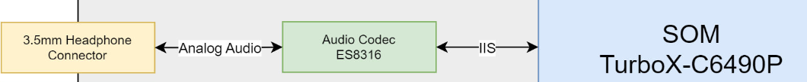
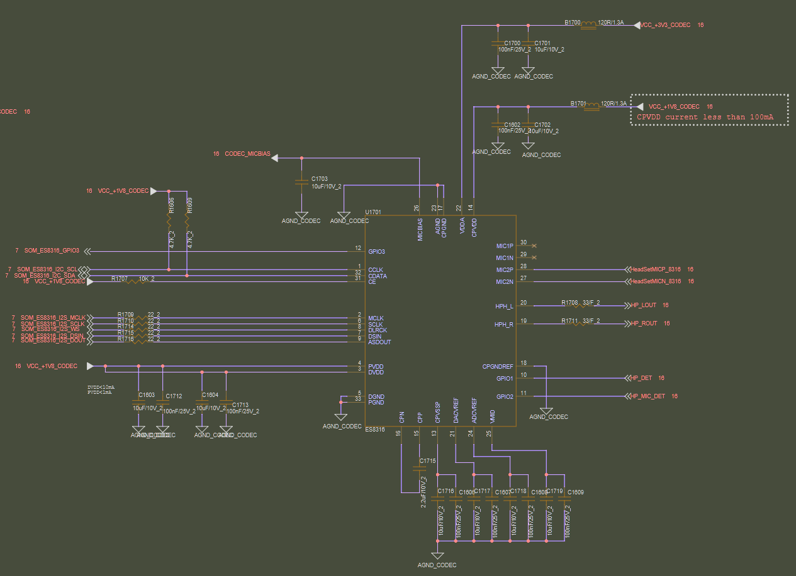

# RubikPi 3 Audio Stack 文件

[RubikPi AI](https://rubikpi.ai/)


# Audio Component



# 電路：




RubikPi 3 相關 GitHub 函式庫：

- [rubikpi-ai/linux](https://github.com/rubikpi-ai/linux)
- [rubikpi-ai/linux-android13](https://github.com/rubikpi-ai/linux-android13)
- [rubikpi-ai/linux-debian](https://github.com/rubikpi-ai/linux-debian)
- [rubikpi-ai/meta-rubikpi-bsp](https://github.com/rubikpi-ai/meta-rubikpi-bsp)
- [rubikpi-ai/meta-rubikpi-distro](https://github.com/rubikpi-ai/meta-rubikpi-distro)
- [rubikpi-ai/device-tree](https://github.com/rubikpi-ai/device-tree)

---

## 硬體概覽

| 項目 | 內容 |
|------|------|
| SoC | Qualcomm QCS6490 (基於 SC7280 架構) |
| 音頻 Codec | Everest Semiconductor ES8316 |
| I2C 地址 | 0x11 (i2c0 總線) |
| I2S 接口 | PRIMARY MI2S (Playback + Capture) |
| MCLK | LPASS MCLK1，頻率 24.576 MHz (永久開啟) |
| Jack IRQ | GPIO63 (EDGE_BOTH)，極性反轉 |
| 電源控制 | GPIO117 (regulator-fixed，always-on) |

## 相關原始碼位置 (rubikpi-ai/linux)

```
sound/soc/qcom/qcm6490.c                                     ← ASoC machine driver
sound/soc/codecs/es8316.c                                     ← ES8316 codec driver
sound/soc/codecs/es8316.h                                     ← ES8316 register map
arch/arm64/boot/dts/qcom/qcs6490-thundercomm-rubikpi3.dts    ← 頂層 DTS
arch/arm64/boot/dts/qcom/qcs6490-thundercomm-rubikpi3.dtsi   ← 主要配置
```

## 音頻信號路徑

```
【Playback 播放路徑】
ADSP Q6 DSP
  → PRIMARY_MI2S_RX (q6apmbedai)
  → I2S 總線:
      GPIO96 = MCLK (24.576 MHz，永久開啟)
      GPIO97 = BCLK (1.536 MHz)
      GPIO100 = WS (Word Select / LRCLK)
      GPIO98  = DATA0 (音頻資料輸出)
  → ES8316 (I2C 0x11，解碼)
  → 耳機插孔 (Headphone Jack)

【Capture 錄音路徑】
麥克風 (MIC)
  → ES8316 (I2C 0x11，編碼)
  → I2S 總線:
      GPIO99 = DATA1 (音頻資料輸入)
  → PRIMARY_MI2S_TX (q6apmbedai)
  → ADSP Q6 DSP

【HDMI 音頻路徑】
ADSP Q6 DSP → QUATERNARY_MI2S_RX → LT9611 HDMI bridge → HDMI 輸出

【Jack 偵測路徑】
耳機插拔 → GPIO63 中斷 (EDGE_BOTH，極性反轉)
         → ES8316 jack detect → ALSA Jack 事件
```

## 詳細分析文件

### Kernel & Device Tree

- [Kernel&DT/es8316_driver_analysis.md](Kernel&DT/es8316_driver_analysis.md) — ES8316 驅動程式分析
- [Kernel&DT/qcm6490_machine_driver.md](Kernel&DT/qcm6490_machine_driver.md) — QCM6490 機器驅動分析
- [Kernel&DT/device_tree_analysis.md](Kernel&DT/device_tree_analysis.md) — Device Tree 配置分析

### Yocto Audio Stack

- [Yocto_bb/audio_stack_yocto_analysis.md](Yocto_bb/audio_stack_yocto_analysis.md) — Yocto Metadata Layer 音頻架構分析（7 層全覽）

### 實驗手冊（Hardware-Verified）

- [Audio_Experiment/layer1_application_audio_lab.md](Audio_Experiment/layer1_application_audio_lab.md) — Layer 1 Application Layer 深度分析與 RubikPi3 實驗手冊  
  （PulseAudio system mode 實測、工具分層、9 組實驗結果）

---

## 相關資源

### RubikPi GitHub

- [rubikpi-ai/linux](https://github.com/rubikpi-ai/linux)
- [rubikpi-ai/linux-android13](https://github.com/rubikpi-ai/linux-android13)
- [rubikpi-ai/linux-debian](https://github.com/rubikpi-ai/linux-debian)
- [rubikpi-ai/meta-rubikpi-bsp](https://github.com/rubikpi-ai/meta-rubikpi-bsp)
- [rubikpi-ai/meta-rubikpi-distro](https://github.com/rubikpi-ai/meta-rubikpi-distro)
- [rubikpi-ai/device-tree](https://github.com/rubikpi-ai/device-tree)
- [rubikpi-ai/WiringRP](https://github.com/rubikpi-ai/WiringRP)
- [rubikpi-ai/WiringRP-Python](https://github.com/rubikpi-ai/WiringRP-Python)

### Qualcomm Linux GitHub

- [qualcomm-linux/kernel](https://github.com/qualcomm-linux/kernel)
- [qualcomm-linux/meta-qcom](https://github.com/qualcomm-linux/meta-qcom)
- [qualcomm-linux/meta-qcom-hwe](https://github.com/qualcomm-linux/meta-qcom-hwe)
- [qualcomm-linux/meta-qcom-qim-product-sdk](https://github.com/qualcomm-linux/meta-qcom-qim-product-sdk)

### Qualcomm 官方文件

- [Qualcomm Linux Audio — Overview (80-70018-16)](https://docs.qualcomm.com/doc/80-70018-16/topic/overview.html?product=895724676033554725&facet=Audio&version=1.4)
- [Qualcomm Linux Audio — APIs and Sample Apps (80-70015-16)](https://docs.qualcomm.com/doc/80-70015-16/topic/apis_and_sample_apps.html?product=895724676033554725&facet=Audio&version=1.2)

